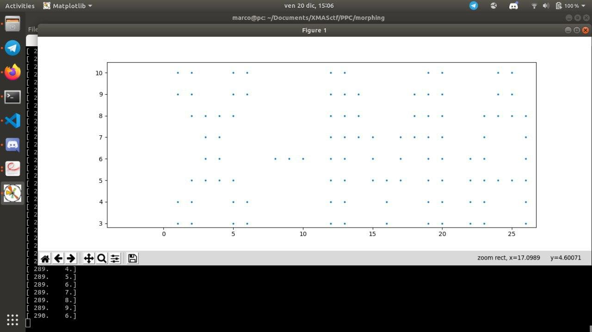

# Santa's Elf Morphing Machine

Solution provided by: [Gianluca Lofrumento](https://github.com/github.io/glofru), [Alessio Di Santo](https://github.com/github.io/alessiobb3b) e [Marco Pinna](https://github.com/github.io/MPinna)

## Problem
Problem in _problem.pdf_ file and a useful information in the challenge description

## Solution

### Find _Ai_ matrix
First of all we have to find _Ai_'s eigenvalues.
Given the generic 2x2 matrix  
  
we know that its characteristic polynomial is
  
 
 
 
 
 

So just with the trace and determinant of _A_ we can find its eigenvalues.
Then from the process of diagonalization of a matrix we know that 
 
 
where:
 - _R_ is the modal matrix, that is a matrix containing the eigenvectors of A in its columns
 - _J_ is the diagonal matrix of _A_'s eigenvalues

We have everything (clearly we have to invert the modal matrix) so we can easily find the matrix _A_.
### Use the matrix _Ai_
We know 
 
that means
 
where xi and yi are the coordinates in input while xo and yo are the coordinates in output.

Moreover from the text we know that 
 
and that the initial coordinate are (1,3). 
We have just implemented all this in a python program and that was the result: 
 

