# Santa's Elf Morphing Machine

Solution provided by: [Gianluca Lofrumento](https://github.com/github.io/glofru), [Alessio Di Santo](https://github.com/github.io/alessiobb3b) e [Marco Pinna](https://github.com/github.io/MPinna)

## Problem
Problem in _problem.pdf_ file and a useful information in the challenge description

## Solution

### Find _Ai_ matrix
First of all we have to find _Ai_'s eigenvalues.
Given the generic 2x2 matrix  
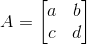  
we know that its characteristic polynomial is
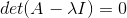  
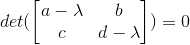 
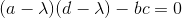 
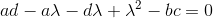 
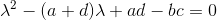 
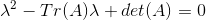 

So just with the trace and determinant of _A_ we can find its eigenvalues.

Then from the process of diagonalization of a matrix we know that 
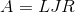 
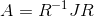 

If we set 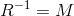, we obtain the similarity transformation:
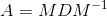 

where:
 - _M_ is the modal matrix, that is a matrix containing the eigenvectors of A in its columns
 - _D_ is the diagonal matrix of _A_'s eigenvalues, also called 'spectral matrix'

We have everything (clearly we have to invert the modal matrix) so we can easily find the matrix _A_.
### Use the matrix _Ai_
We know 
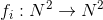 

that means  
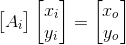 
where xi and yi are the coordinates in input while xo and yo are the coordinates in output.

Moreover from the text we know that 
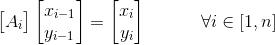 
and that the initial coordinate are (1,3).

We have implemented all this in a python script, after editing a little bit the 'trans.txt' file, as there were some irregularities in the blank spaces that were messing up the `.find()` function in the script (yes, we could have used a regex, but in this case it was way faster to even out the 'trans.txt' file).

The `round()` function at lines 54-55 in the script is needed because of the following reason:
every fi transformation applies a linear mapping from 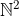 to  . This, however, does not imply that every Ai matrix only has natural components. In fact, the matrices belong to 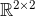.  
Since we're dealing with floats, that have a limited precision, approximation errors are always behind the corner. Furthermore, since the output of the i-th iteration is the input of the (i+1)th iteration, we also have to deal with error propagation and amplification.
The `round()` function takes care of all these issues.
You can try and remove it from the script, to have a nice example of what those issues can lead to if they're not properly taken care of.

We computed all the points, plotted them on a scatter plot and got the flag

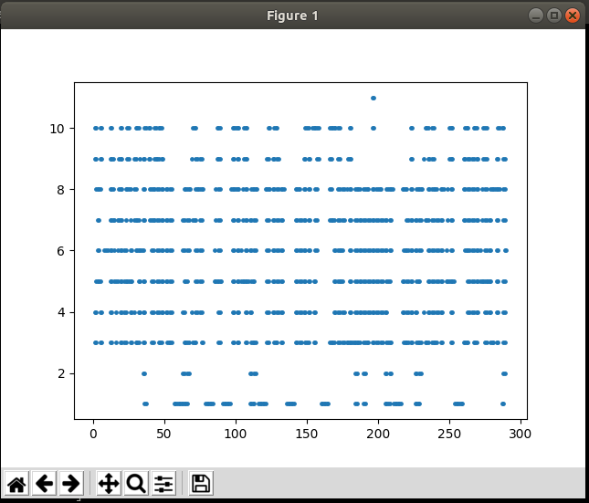  
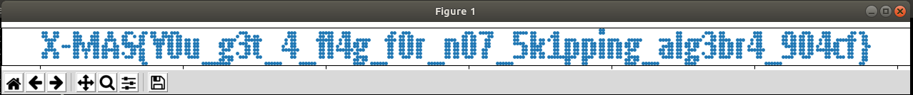

